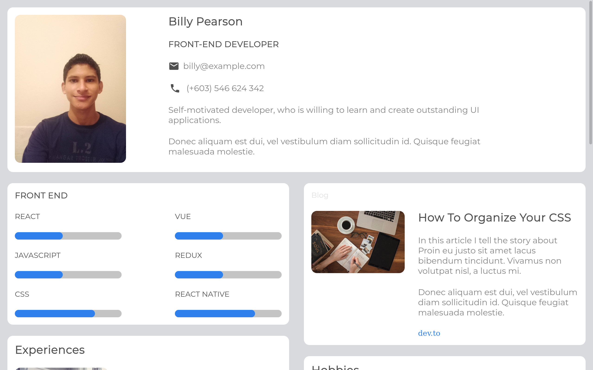

<main>
<section>
    <h1 align="center"> Portfolio Master </h1>
</section>
 <section>
    <h3 align="center"> Solución para un desafío de <a href="https://devchallenges.io/">Devchallenges.io</a> </h3>

<section align="left">
     <h2> Tabla de Contenido </h2>
</section>
<nav>
    <ul>
        <li><a href="">Descripciòn General</a></li>
        <li><a href="">Soluciòn</a></li>
        <li><a href="-">Construido Con</a></li>
        <li><a href="">Caracteristicas</a></li>
        <li><a href="">Contacto</a></li>    
    </ul>
</nav>
<section >
    <section>
        <h2 > Descripciòn General </h2>
    </section>
    <section >
         
    <section>
   
</section>

</section>
    <section >
    <h2> Soluciòn </h2>
    <nav>
        <ul align="center">
            <h3>
                <a href="https://piguavejc-portfolio-master.onrender.com/">Demo</a> | 
                <a href="https://github.com/jean-carlos-19/portfolio-master">Github </a> | 
                <a href="https://devchallenges.io/solutions/WGD0Dd5DmTn776lKB0WW">Devchallenge</a> </a> | 
                <a href="https://www.figma.com/proto/O7Omgz2iVR7Vox7shf7O8e/portfolio?node-id=1%3A439&scaling=min-zoom&page-id=0%3A1">Figma<a>
            </h3>
        </ul>
    </nav>
</section>

<section >
    <section>
        <h2> Construido Con </h2>
    </section>
    <nav>
        <ul>
            <li>HTML</li>
            <li>CSS</li>
            <li>
                Preprocesadores
                <ul>
                    <li>SASS</li>
                </ul>
            </li>
        </ul>
    </nav>
</section>
<section >
    <h2> Caracteristicas </h2>
    

        Esta aplicación o sitio fue creada como una presentación a un desafío de <a href="http://devchallenges.io" target="_blank">Devchallenges.io</a>. El reto consistía en construir una aplicación para completar las historias de usuario dadas.
    

     

        Desafío: crea todos los elementos en los diseños dados y luego crea un portafolio con tu propio contenido. Puede crear su propio diseño . Puede usar React, Vue.js u otras bibliotecas para crear un componente reutilizable, pero no es obligatorio. No mire la solución existente. Cumplir con las historias de usuario a continuación:
     

     <nav>.
        <ul>
            <li>Historia de usuario: puedo ver los datos personales</li> 
            <li>Historia de usuario: puedo ver las habilidades</li> 
            <li>Historia de usuario: puedo ver proyectos</li> 
            <li>Historia de usuario: puedo filtrar proyectos por etiqueta</li> 
            <li>Historia de usuario: puedo ver pasatiempos o certificados</li> 
            <li>Historia de usuario (opcional): puedo ver experiencia</li> 
            <li>Historia de usuario: puedo filtrar proyectos por etiquetas</li> 
            <li>Historia de usuario (opcional): puedo ver blogs</li> 
            <li>Historia de usuario (opcional): puedo ver proyectos en diferentes páginas</li> 
    </ul>
    </nav>
</section>
<section >
     <section>
        <h2> Contacto </h2>
    </section>
    <nav>
        <ul>
            <li>Github <a href="https://github.com/jean-carlos-19">@jean-carlos-19</a></li>
            <li>Twitter <a href="https://twitter.com/PiguaveJean">@PiguaveJean</a></li>
        </ul>
</nav>
</section>
</main>
